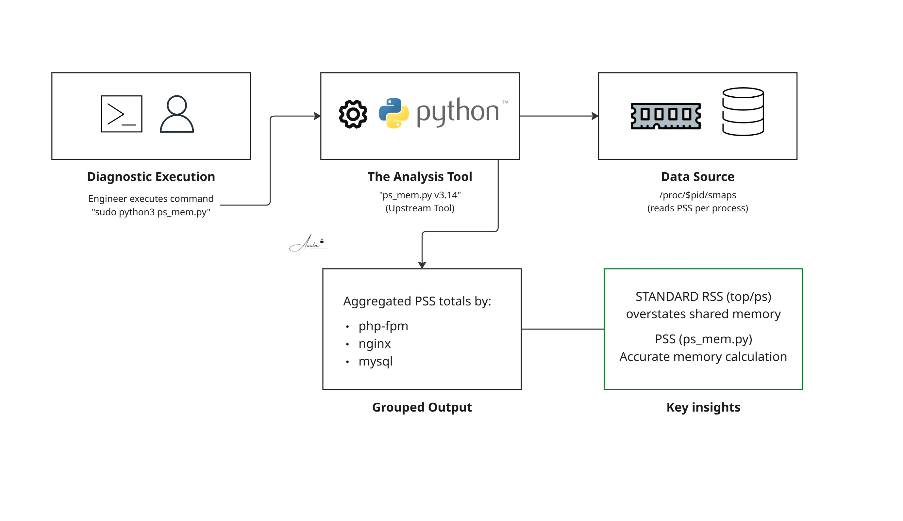

# Project 14: PHP-FPM Memory Diagnostic

This repository vendors the `ps_mem.py` utility to serve as a standardized, on-host incident response tool for diagnosing severe memory pressure (OOM events) across PHP-FPM, Apache, and MySQL workloads on EC2 instances. 

Unlike standard `top` or `ps` utilities that heavily inflate apparent memory usage by double-counting shared libraries (RSS), this tool calculates the **Proportional Set Size (PSS)**. By accurately dividing shared memory across all active worker processes, it provides the precise, real-world memory footprint required to properly calculate and tune `pm.max_children` limits in PHP-FPM.

*Source: [Pixelbeat ps_mem](https://www.pixelbeat.org/scripts/ps_mem.py) | License: LGPLv2*

## Architecture



## Usage

Elevated privileges (`sudo`) are strictly required to accurately read `/proc/$pid/smaps` across all user spaces and accurately calculate shared memory overlap.

```bash
# Output a per-program memory summary, sorted by size (smallest to largest)
sudo python3 ps_mem.py

# Isolate memory consumption for a specific process ID
sudo python3 ps_mem.py -p 1234

# Output only the total memory consumed by all analyzed processes
sudo python3 ps_mem.py -t

# Include swap usage in the calculation for deep OOM debugging
sudo python3 ps_mem.py --swap
```

## Operational Notes

*   **Upstream Integrity:** This is an unmodified vendored copy of the upstream tool, maintained here specifically for rapid deployment during live incident response.
*   **Kernel Compatibility:** The script relies on `/proc/$pid/smaps` PSS metrics available in modern Linux kernels, but is engineered to fail open and fall back gracefully on older legacy kernels.
*   **Monitoring Strategy:** This tool is strictly for interactive, live-fire diagnosis. For persistent, fleet-wide memory monitoring, deploy the AWS CloudWatch Agent's `procstat` plugin.
